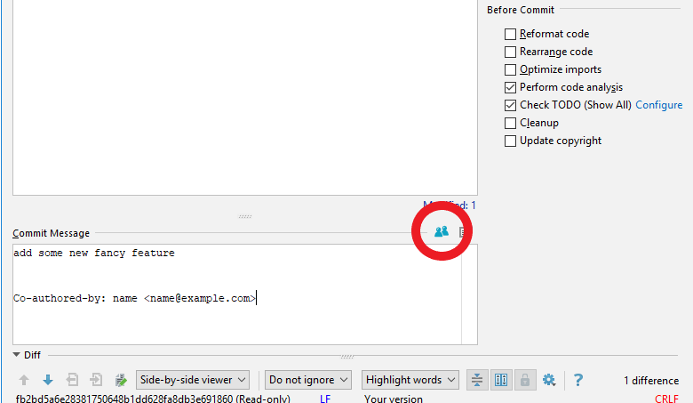

# Co-Author - plugin for JetBrains IDEs

Attribute commits to more authors using the `Co-authored-by:` commit trailers based on the
[Creating a commit with multiple authors](https://help.github.com/articles/creating-a-commit-with-multiple-authors/)
article.

### Installation

TBA

### Configuration

The plugin stores the list of teammates, co-workers in your user's HOME directory in the `.git_coauthors` file
(e.g.:  `~/.git_coauthors` or `C:\Users\bill\.git_coauthors`). Every person's data is stored using the
`username <email.address@example.com>` format. E.g.:

    name <name@example.com>
    another-name <another-name@example.com>
    
The config file will be created at the first usage. Feel free to modify this, however the author list can be edited
using the UI. 

### Usage

In the `Commit Changes` dialog, after you finished composing your commit message, click on the Co-Author icon
, select your co-author(s) and click `OK`. The commit message will be updated
instantly.

Authors can be added / removed with the proper button, or modified by double-clicking on them.

### Credits

Copyright 2018 Robert Gargya <robert.gargya@gmail.com>

Co-Author [icon](https://www.flaticon.com/free-icon/users_125773) made by 
[Gregor Cresnar](https://www.flaticon.com/authors/gregor-cresnar "Gregor Cresnar") from 
[www.flaticon.com](https://www.flaticon.com/ "Flaticon") is licensed by
[CC 3.0 BY](http://creativecommons.org/licenses/by/3.0/ "Creative Commons BY 3.0")
